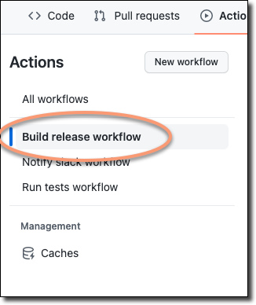
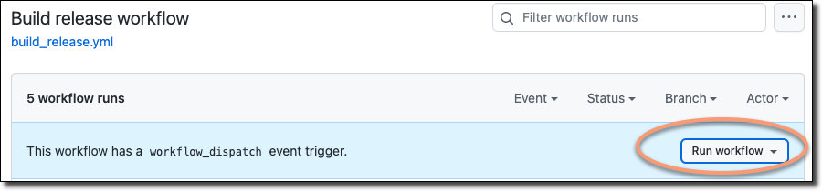
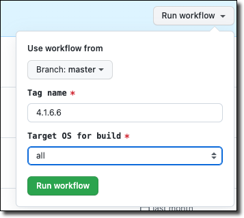

# Building Dash Electrum executables

This document describes two methods for building executable versions of the Dash Electrum application:
 - [Building Dash Electrum on a local computer](#building-dash-electrum-on-a-local-computer)
 - [Building Dash Electrum executables using GitHub Actions](#building-dash-electrum-executables-using-github-actions)

## Building Dash Electrum on a local computer

This section will discuss building executable versions for the following target hardware platforms:  
 - [macOS](#building-dash-electrum-executables-for-macos)
 - [Linux](#building-dash-electrum-executables-for-linux)
 - [Windows](#building-dash-electrum-executables-for-windows)
 - [Android](#building-dash-electrum-executables-for-android)

### Building Dash Electrum executables for macOS

#### 1. Prepare the macOS operating system
To build Dash Electrum binaries, you will need a computer running **macOS 11**. Since the process 
involves installing additional software and is also sensitive to packages already 
installed, it is recommended that you use a virtual machine for this purpose.

#### 1. Install the required applications
In this step, we will install *XCode Command Line Tools* and *Homebrew*. To do this, start the 
*Terminal* application and execute the following commands:
```
xcode-select --install
/bin/bash -c "$(curl -fsSL https://raw.githubusercontent.com/Homebrew/install/master/install.sh)"
```
> **Note**: during installation, you may be asked to confirm the license terms and conditions and to enter the 
> password for your current account in order to gain the required permissions.

#### 2. Download the Dash Electrum source code and execute the build scripts
Open the *Terminal* app and execute the following commands:
```
cd ~/Documents
git clone https://github.com/Bertrand256/electrum-dash.git
```

#### 3. Execute the build scripts
> **Note**: at this point, you can assign a different version number to the newly-built 
> application, than the one that is currently entered in the source code. If you want to 
> do that, follow [these steps](#changing-the-dash-electrum-version-number).

Open the *Terminal* app and execute the following commands:
```
/bin/bash
cd ~/electrum-dash
source ./contrib/dash/travis/electrum_dash_version_env.sh
./contrib/dash/actions/install-osx.sh
./contrib/dash/actions/script-osx.sh
```
Enter the password for your current macOS account when needed.

After a successful build, the resulting files can be found in the `~/dist` folder:
```
dist\Dash Electrum.app
dist\Dash-Electrum-X.X.X.X.dmg
```
where `X.X.X.X` is the version number.


### Building Dash Electrum executables for Linux

#### 1. Prepare the operating system 
In the following process, we will use a computer running the **Ubuntu 20.04** or **Ubuntu 22.04** operating system. It can be either 
a physical or a virtual machine, but for practical reasons I recommend the latter - 
to avoid possible package conflicts, it should be a "clean" system, which is very easy to achieve in 
a virtual machine, but not so easy on a computer that was used for some time. 
So, even if you have the required Ubuntu OS release on your physical machine, I suggest you 
install virtualization software (such as VirtualBox) and then install the virtual OS on which
you will be performing the following steps.

#### 2. Update your system and install the required software
In the Linux terminal, execute the following commands:
```
sudo apt-get update && \
sudo apt-get -y upgrade && \
sudo apt-get -y install libfuse2 git gettext python3-virtualenv ca-certificates curl gnupg lsb-release && \
sudo mkdir -m 0755 -p /etc/apt/keyrings && \
curl -fsSL https://download.docker.com/linux/ubuntu/gpg | sudo gpg --dearmor -o /etc/apt/keyrings/docker.gpg && \
echo "deb [arch=$(dpkg --print-architecture) signed-by=/etc/apt/keyrings/docker.gpg] https://download.docker.com/linux/ubuntu \
  $(lsb_release -cs) stable" | sudo tee /etc/apt/sources.list.d/docker.list > /dev/null && \
sudo apt-get update && \
sudo apt-get -y install docker-ce docker-ce-cli containerd.io docker-buildx-plugin docker-compose-plugin && \
sudo usermod -aG docker $USER  
```

#### 3. Re-login or restart your OS
This step is needed to force a docker group membership re-evaluate on your OS. If you are performing the steps on 
a virtual machine, restart it, if on a physical computer - re-login (log out and log back in).

#### 4. Download the Dash Electrum source code from GitHub
> **Note**: if you have previously built versions of Dash Electrum on the same machine, delete the 
> directory where previous operations were performed:
> ```
> sudo rm -r ~/electrum-dash
> ```

In the Linux terminal, execute the following commands:
```
cd ~
git clone https://github.com/Bertrand256/electrum-dash.git
```

#### 5. Run the build scripts
> **Note**: at this point, you can assign a different version number to the newly-built 
> application, than the one that is currently entered in the source code. If you want to 
> do that, follow [these steps](#changing-the-dash-electrum-version-number).

In the Linux terminal, execute the following commands:
```
cd ~/electrum-dash
./contrib/dash/actions/install-linux.sh
./contrib/dash/actions/script-linux.sh
```

After a successful build, the resulting files can be found in the `~/dist` folder:
```
dist\Dash-Electrum-X.X.X.X.AppImage
dist\Dash-Electrum-X.X.X.X.tar.gz
dist\Dash-Electrum-X.X.X.X.tar.zip
```
where `X.X.X.X` is the version number, the `.AppImage` file is an executable that can be 
run directly (without the need of installing anything) and the `.tar.gz` and `.zip` 
files are archives from which the Dash Electrum application can be launched (after unpacking), but 
only after prior installing the required software packages.

### Building Dash Electrum executables for Windows
> **Note:** Although this section is about building executables for Windows, we'll be doing this on a 
Linux machine. The reason is that it is much easier to configure a Windows emulation environment 
available for Linux (Wine) with all the necessary tools and repeatable results than to do it 
in an actual Windows GUI. What can be done with automatic scripts under Wine 
would be a lengthy description with many manual steps in graphical Windows.
> 
> In addition to the disadvantages of Windows mentioned above, it should also be mentioned that Windows is not 
> free, which greatly reduces the attractiveness of using it for "secondary" purposes.

#### 1. Prepare your system and install the required software 
Follow steps 1-5 from the chapter on Linux binaries:  
 a) [Prepare the operating system](#1-prepare-the-operating-system)  
 b) [Update your system and install the required software](#2-update-your-system-and-install-the-required-software)  
 c) [Re-login or restart your OS](#3-re-login-or-restart-your-os)  
 d) [Download the Dash Electrum source code from GitHub](#4-download-the-dash-electrum-source-code-from-github)  

#### 2. Run the build scripts
> **Note**: at this point, you can assign a different version number to the newly-built 
> application, than the one that is currently entered in the source code. If you want to 
> do that, follow [these steps](#changing-the-dash-electrum-version-number).

In the Linux terminal, execute the following commands:
```
cd ~/electrum-dash
./contrib/dash/actions/install-wine.sh
./contrib/dash/actions/script-wine.sh
```

After successful build, separate installers for 32-bit and 64-bit Windows will be created 
in the `dist` subdirectory:
```
Dash-Electrum-X.X.X.X-setup-win32.exe
Dash-Electrum-X.X.X.X-setup-win64.exe
```
where `X.X.X.X` is the version number.

### Building Dash Electrum executables for Android
Similar to the Windows binaries, building for Android will be done on a Linux machine.

#### 1. Prepare your system and install the required software 
Follow steps 1-5 from the chapter on Linux binaries:  
 a) [Prepare the operating system](#1-prepare-the-operating-system)  
 b) [Update your system and install the required software](#2-update-your-system-and-install-the-required-software)  
 c) [Re-login or restart your OS](#3-re-login-or-restart-your-os)  
 d) [Download the Dash Electrum source code from GitHub](#4-download-the-dash-electrum-source-code-from-github)  

Install the JDK to access the tools needed to sign Android APK files:
```
sudo apt install openjdk-17-jdk-headless
```

#### 2. Run the build scripts
> **Note**: at this point, you can assign a different version number to the newly-built 
> application, than the one that is currently entered in the source code. If you want to 
> do that, follow [these steps](#changing-the-dash-electrum-version-number).

In the Linux terminal, execute the following commands:
```
cd ~/electrum-dash
source ./contrib/dash/travis/electrum_dash_version_env.sh
./contrib/dash/actions/install-linux-apk.sh

# building binaries for MAINNET:
export ELECTRUM_MAINNET=true
export APP_ANDROID_ARCH=arm64-v8a
./contrib/dash/actions/script-linux-apk.sh

export APP_ANDROID_ARCH=armeabi-v7a
./contrib/dash/actions/script-linux-apk.sh

# building binaries for TESTNET:
export ELECTRUM_MAINNET=false
export APP_ANDROID_ARCH=arm64-v8a
./contrib/dash/actions/script-linux-apk.sh

export APP_ANDROID_ARCH=armeabi-v7a
./contrib/dash/actions/script-linux-apk.sh
```

> **Note**: during the process, you may be prompted to enter your password to execute a command that requires 
> sudo permission.

After the correct build, separate APK files will be created in the `dist` directory for the 
two most popular mobile hardware platforms, broken down by the type of Dash network they will
connect to, namely: TESTNET and MAINNET:
```
Electrum_DASH-X.X.X.X-arm64-v8a-release-unsigned.apk
Electrum_DASH-X.X.X.X-armeabi-v7a-release-unsigned.apk
Electrum_DASH_Testnet-X.X.X.X-arm64-v8a-release-unsigned.apk
Electrum_DASH_Testnet-X.X.X.X-armeabi-v7a-release-unsigned.apk
```
where `X.X.X.X` is the version number.

#### 3. Signing APK files with your own development certificate
The APK files built in the previous step are unsigned and, as such, cannot be easily run on 
modern Android phones. Therefore, they must be signed with a developer certificate, which anyone 
can create on their own.

> **Note**: to use the `keytool` and `jarsigner` programs, it is necessary to install the Java JDK 
> and add its `bin` subfolder to the system path.
> On Ubuntu Linux you can do this by tunning the following command:   
> ```sudo apt install openjdk-17-jdk-headless```

##### 3.1 Generate a keystore [optional] 
Do this only if you haven't done it before. You can do this using Android Studio (by following this
guide: https://developer.android.com/studio/publish/app-signing.html#generate-key) or using the command 
line, by executing the following command:
```
keytool -genkey -v -keystore KEYSTORE_FILE_NAME -keyalg RSA -keysize 2048 -validity 10000 -alias KEY_ALIAS
```

where:
 - KEYSTORE_FILE_NAME: name of the file that will contain your keystore, for example: `dash_electrum.keystore` 
 - KEY_ALIAS: a string that in the keystore will specify the key used to sign this application, for example: `Dash-Electrum` 

Example:
```
keytool -genkey -v -keystore dash_electrum.keystore -keyalg RSA -keysize 2048 -validity 10000 -alias Dash-Electrum
```

During the process you will be asked for new password to be set for keystore and some personal details:  
```
Enter keystore password:  
Re-enter new password: 
What is your first and last name?
  [Unknown]:  John Doe
What is the name of your organizational unit?
  [Unknown]:  Dev department
What is the name of your organization?
  [Unknown]:  Dash Electrum Builders
What is the name of your City or Locality?
  [Unknown]:  London
What is the name of your State or Province?
  [Unknown]:  
What is the two-letter country code for this unit?
  [Unknown]:  GB
Is CN=John Doe, OU=Dev department, O=Dash Electrum Builders, L=London, ST=Unknown, C=GB correct?
  [no]:  y
```
Unless you're going to publish the app on the Google Play Store, the information you enter doesn't really matter.

##### 3.2 Sign the executable files
From your commandline terminal, execute the following commands, changing *dash_electrum.keystore*, *Dash-Electrum* and 
*X.X.X.X* to appropriate values (keystore file name, app version and key name, respectively):
```
jarsigner -verbose -sigalg SHA256withRSA -digestalg SHA-256 -keystore dash_electrum.keystore dist/Electrum_DASH-X.X.X.X-arm64-v8a-release-unsigned.apk Dash-Electrum
jarsigner -verbose -sigalg SHA256withRSA -digestalg SHA-256 -keystore dash_electrum.keystore dist/Electrum_DASH-X.X.X.X-armeabi-v7a-release-unsigned.apk Dash-Electrum
jarsigner -verbose -sigalg SHA256withRSA -digestalg SHA-256 -keystore dash_electrum.keystore dist/Electrum_DASH_Testnet-X.X.X.X-arm64-v8a-release-unsigned.apk Dash-Electrum
jarsigner -verbose -sigalg SHA256withRSA -digestalg SHA-256 -keystore dash_electrum.keystore dist/Electrum_DASH_Testnet-X.X.X.X-armeabi-v7a-release-unsigned.apk Dash-Electrum
```

And finally, rename the file names to reflect the fact that they are no longer unsigned:
```
for file in dist/*; do mv "${file}" "${file/-unsigned/}"; done
```

### Notes
#### Changing the Dash Electrum version number 
The version number, which is built into the binaries and then presented both in the 
application itself (after its launch) and in the names of the output files, can be 
changed by editing one of the source files before starting the build.

To change it, open the file `./electrum_dash/version.py` in your preferred text editor and 
then set the proper value to the variables `ELECTRUM_VERSION` and `APK_VERSION`.

Example:
```python
ELECTRUM_VERSION = '4.2.0.0'
APK_VERSION = '4.2.0.0'
```


## Building Dash Electrum executables using GitHub Actions
The GitHub service has a mechanism for running dedicated scripts within virtual machines, based on the selected type 
and version of the operating system. This mechanism (called GitHub Actions) uses a scripting language that allows 
you to build virtually any workflow related to software delivery, including, for example, building executable versions.

As part of Dash Electrum, this functionality is used. A dedicated script (`.github/workflows/build_release.yml`) was 
created that allows you to build binaries for all supported platforms, completely within GitHub, i.e. without the 
need to perform any operation on the local computer.

### 1. Go to the *Actions* tab of your Dash Electrum repository

> **Note**: if you are using your own fork of this project, at this point you will probably be asked to accept the 
 terms of use of the mechanism, which should be done by clicking on the **I understand my workflows, go ahead and 
 enable them** button.

### 2. Activate *Build release workflow*
Click the *Build release workflow* on the top-left:  


### 3. Invoke the *Run workflow* dialog
Click *Run workflow* link/button on the right:  


### 4. Set the parameters for the build to run:  
 In the dialog box that will be show, set the appropriate parameters:    


**Tag name**: the name of the release GitHub, to which the built result files will be copied. We have adopted the rule 
that as the release name we enter the version number of the Dash Electrum application that is currently set in the 
source code (see [here](#changing-the-dash-electrum-version-number)).
>**Notes**: If a release with this number does not exist in GitHub for this project, it will be created based on the 
> latest commit. If such a release exists, make sure that it does not contain files with the same names that will be 
> built, otherwise the process will report an error - the files will not be overwritten.
 
**Target OS for buid**: here you choose for which target OS the build should be performed, or for all. You 
can choose from the following options:
 - All
 - Linux
 - Windows
 - macOS
 - Android

### 5. Start the build proces
After clicking the *Run workflow* button, the build process will start. Depending on the selected target(s), the execution 
time may be from several to several dozen minutes. Once the build has completed successfully, you'll find the results 
in the release page you entered at startup.

> **Notes**: keep in mind that the building process involves the use of some computing power, which comes at some cost 
> to the service provider. Free GitHub accounts come with a certain number of free minutes per month (quite a 
> lot at the moment), but if you exceed them, you may incur additional fees. You can check the current usage of these 
> free minutes in the *Billing and plans* tab of your GitHub account settings.